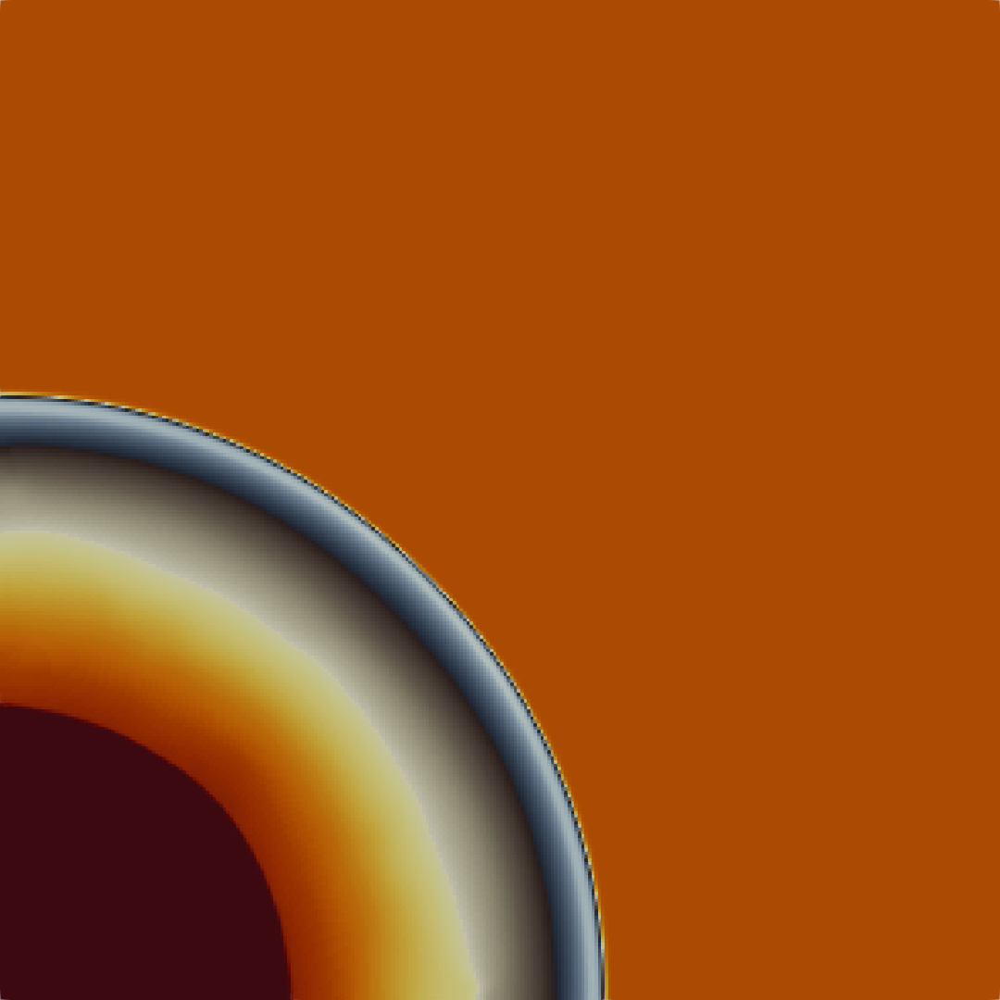

# Computational Overpressure Shock Modelling Operator (COSMO)

COSMO is an Eulerian finite volume solver written in **Julia**. It currently supports two-dimensional axisymmetric models and generates output in VTK format. It has preliminary support for parallel simulation with MPI.

<div align="left">
  
</div>

## What it does

Solves the compressible Euler equations in cylindrical (r, z) coordinates on a uniform structured grid. Numerical ingredients are deliberately conservative choices that work for almost any blast / shock problem out of the box:

- **HLLC** approximate Riemann solver (Toro, Spruce & Speares 1994)
- **MUSCL** spatial reconstruction with the **minmod** slope limiter (TVD)
- **SSP-RK2** (Heun) explicit time integration
- Two built-in equations of state:
  - **Ideal gas** (gamma = 1.4) for ambient air
  - **JWL** (Jones-Wilkins-Lee) for TNT detonation products
- Mixed-EOS blending via a per-cell **burn fraction** lambda in [0, 1]
- **Programmed burn** IC by default (spherical detonation front from the
  initiation point at velocity D); **Brode compressed-gas balloon** IC optional
- Reflective BC at r = 0 (axis) and at z = 0 (rigid ground / symmetry plane);
  zero-gradient outflow at r_max and z_max
- **MPI parallelism** with simple geometric block decomposition along (r, z), non-blocking halo exchange on the conservative state and the burn field, and a Gatherv-based VTK writer

Imperial units throughout (`in`, `s`, `psi`, `lbf*s^2/in^4`).

## Layout

```
cosmo/
├── Project.toml             # Julia environment (deps only)
├── README.md
├── run.jl                   # entry-point script
├── examples/
│   └── sphere/
│       └── input.jsonc      # 1-lbf TNT free-air burst smoke test (JSON with // comments)
└── src/
    ├── COSMO.jl             # module file
    ├── eos.jl               # ideal gas + JWL EOS, constants
    ├── config.jl            # JSON input parser
    ├── parallel.jl          # MPI topology, partitioning, halo exchange
    ├── grid.jl              # local structured (r, z) grid + ghost cells
    ├── charge.jl            # charge geometry, programmed burn, IC modes
    ├── reconstruct.jl       # MUSCL + minmod limiter
    ├── riemann.jl           # HLLC flux (mixed-EOS aware)
    ├── boundary.jl          # ghost-cell BCs (physical edges only)
    ├── timeint.jl           # SSP-RK2 time stepper, parallel CFL
    ├── output.jl            # gather + WriteVTK rectilinear snapshots
    └── solver.jl            # run_case() driver
```

## How to run

From the **parent directory of the repository** (i.e., the folder containing `cosmo/`):

```bash
# 1) one-time: install Julia dependencies
julia --project=. -e 'using Pkg; Pkg.instantiate()'

# 2) serial run
julia --project=. ./run.jl cosmo/examples/sphere/input.jsonc

# 3A) parallel run (4 MPI ranks)
mpiexec -n 4 julia --project=. ./run.jl ./examples/sphere/input.jsonc

# 3B) parallel run (4 MPI ranks)
~/.julia/bin/mpiexecjl --project=. -n 4 julia --project=. run.jl examples/sphere/input.jsonc
```

The `MPI.jl` package ships a JLL-built MPI runtime by default; that works without any system MPI install. If you prefer to use a system MPI (e.g. OpenMPI from Homebrew), point `MPI.jl` at it once with:

```bash
julia --project=cosmo -e 'using MPIPreferences; MPIPreferences.use_system_binary()'
```

The example writes its results to `cosmo/examples/sphere/output/`, producing one
`*.vtr` per snapshot and a master `sphere.pvd` time series. Open the `.pvd` in
ParaView (`File -> Open`) to view the blast wave evolving.

To run your own case, copy the example input file, edit the mesh, domain,
charge, and time controls, and run:

```bash
julia --project=cosmo cosmo/run.jl path/to/your_input.jsonc
```

## Input file

Top-level keys (see `examples/sphere/input.jsonc`). The loader strips both
`//` line comments and `/* ... */` block comments before parsing, so input
files may be written in either strict JSON (`.json`) or JSON-with-comments
(`.jsonc`):

| key | meaning | required |
|-----|---------|----------|
| `mesh.nr`, `mesh.nz` | global cell counts in r, z | yes |
| `domain.r_min`, `domain.r_max` | radial extent (in) | r_max yes; r_min defaults to 0 |
| `domain.z_min`, `domain.z_max` | axial extent (in) | z_max yes; z_min defaults to 0 |
| `charge.shape` | `"sphere"` or `"cylinder"` | yes |
| `charge.mass` | charge mass in lbf*s^2/in (consistent units) | one of `mass`/`weight` required |
| `charge.weight` | charge weight in lbf (converted via m = W / g_c, g_c = 386.088 in/s^2) | one of `mass`/`weight` required |
| `charge.center.r`, `.z` | charge centre | yes |
| `charge.cylinder_half_height` | when `shape == "cylinder"` | conditional |
| `charge.explosive_material` | `"tnt"` (only TNT is built in) | optional, default `"tnt"` |
| `charge.detonation_velocity` | detonation velocity in in/s | optional, default = TNT CJ value |
| `charge.initial_condition` | `"programmed_burn"` or `"brode"` | optional, default `"programmed_burn"` |
| `time.t_end` | termination time (s) | yes |
| `time.cfl` | CFL scale factor | optional, default 0.4 |
| `time.dt_max` | hard upper bound on dt (s) | optional |
| `time.scheme` | `"ssp_rk2"` or `"forward_euler"` | optional, default `"ssp_rk2"` |
| `output.directory` | output folder (created if missing) | optional, default `"output"` |
| `output.frequency` | write a snapshot every N steps | optional, default 10 |
| `output.pvd_name` | base name for the master `.pvd` file | optional, default `"cosmo"` |

`r_min == 0` activates the axisymmetric reflective BC at the symmetry axis;
`z_min == 0` activates a rigid-ground reflective BC. Any other values
switch those boundaries to zero-gradient outflow.

## Parallel decomposition

`MPI.Dims_create` chooses a `Px x Py` factorisation of the rank count; each
rank owns a contiguous block of interior cells. Ghost layers are filled by
non-blocking sendrecv halo exchange before every flux evaluation. The CFL
bound and write-time gather use `MPI.Allreduce` and `MPI.Gatherv!`
respectively. Single-rank runs reduce to a 1x1 process grid with PROC_NULL
neighbours, so the same code path covers serial and parallel.
